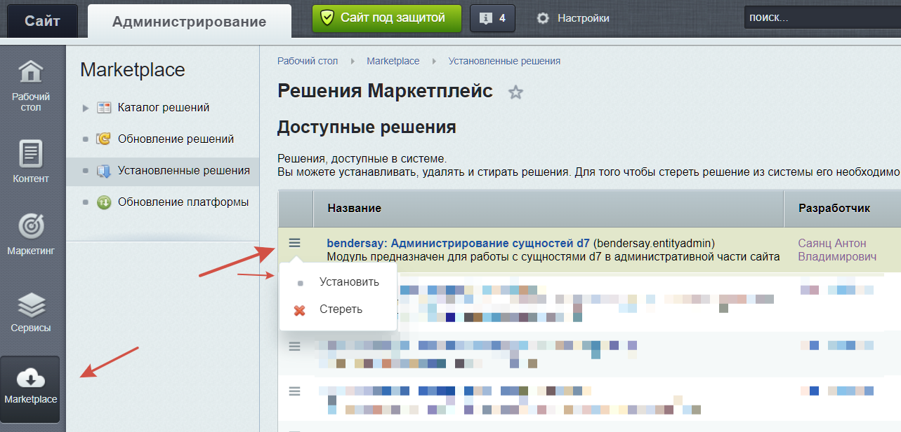

# bendersay: Администрирование сущностей d7
Модуль предназначен для работы с сущностями d7 в административной части сайта

[](https://packagist.org/packages/bendersay/bendersay.entityadmin)
[](LICENSE)
[](https://www.php.net/)
[](https://dev.1c-bitrix.ru/docs/versions.php)

## Самая простая установка 

Скачать архив и распаковать архив в `/local`

## Установка через Composer

Добавить в composer.json проекта:

```json lines
{
  "config": {
    "allow-plugins": {
      "composer/installers": true
    }
  },
  "extra": {
    "installer-paths": {
      "modules/{$name}/": [
        "type:bitrix-d7-module"
      ]
    }
  }
}
```
*в installer-paths нужно указать путь установки модуля относительно файла composer.json*

После этого выполнить команду `composer require bendersay/bendersay.entityadmin`

Установить модуль из админки 1С-Битрикс: Marketplace -> Установленные решения



Добавить в `.gitignore` проекта:
 * папку `/local/modules/bendersay.entityadmin`
 * файлы в папке `bitrix`:
   * `/admin/bendersay_entityadmin_entity_element_edit.php`,
   * `/admin/bendersay_entityadmin_entity_element_list.php`,
   * `/admin/bendersay_entityadmin_reference_element_list.php`

## Структура модуля

Стандартная структура рекомендованная от 1С-Битрикса. [Подробней](https://dev.1c-bitrix.ru/learning/course/index.php?COURSE_ID=43&LESSON_ID=2823&LESSON_PATH=3913.3435.4609.2823)

Ниже перечислю места, на которые следует обратить внимание:

- `install/dependence.json` - зависимости от других модулей
- `lib/Event/` - События из папки, реализующие `EventInterface` автоматически регистрируются/удаляются при установке/удалении модуля
- `lib/Helper/` - папка для хелперов модуля.
- `lib/Install/` - папка для классов используемых при установке/удалении модуля.

____

- [Документация](docs/instruction.md)

