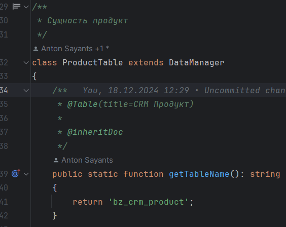
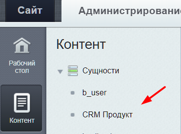

# Аннотации
Для отображения названия сущности в человеко-понятном виде необходимо добавить аннотацию Table к методу getTableName() и указать title.

В результате в административном меню мы увидим нашу аннотацию:

Подробнее о ее использовании можно прочитать в [датаменеджерах](./datamanager.md).

____
- [<- Настройки модуля](./settings.md)
- [<- Сущности](./entities.md)

- [Документация](./instruction.md)
- [README.md](../README.md)