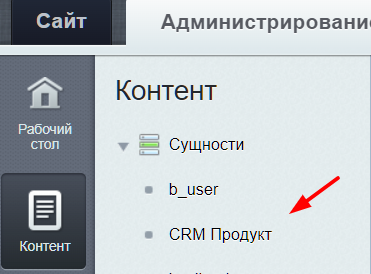
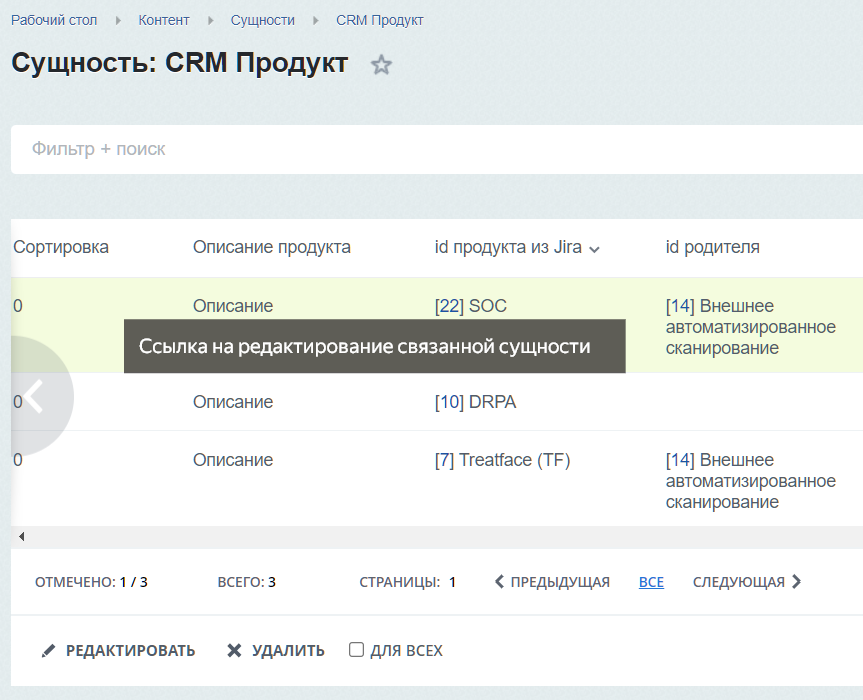
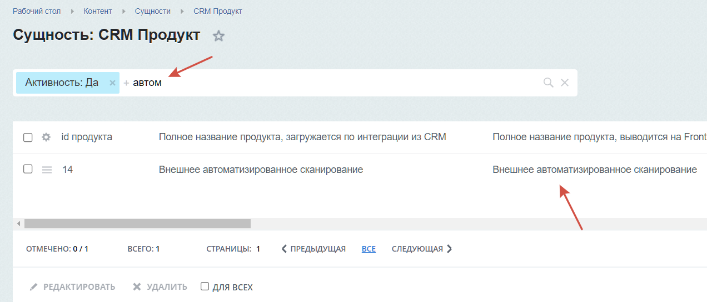
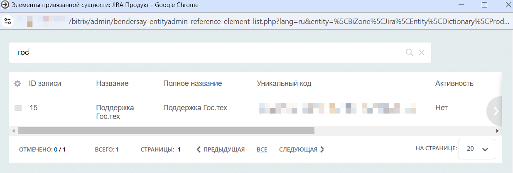

# DataManager
Для каждой сущности обязательно должен быть датаменеджер наследуемый от Bitrix\Main\ORM\Data\DataManager.

## getTitle()
В каждом датаменеджере есть метод getTitle().
Для отображения названия сущности в человеко-понятном виде необходимо реализовать данный статический метод.

Пример указания названия сущности:
```php
/**
 * Сущность продукт
 */
class ProductTable extends DataManager
{
    /**
     * Название сущности
     *
     * @return string
     */
    public static function getTitle(): string
    {
        return 'CRM Продукт';
    }

```

В результате в административном меню мы увидим наше название сущности:



## getMap()
Кроме метода getTitle() в каждом датаменеджере есть метод getMap().
При конструировании поля можно указать его название для человеко-понятного отображения с помощью configureTitle(), а также проставить возможность редактирования с помощью configureAutocomplete().
```php
public static function getMap(): array
    {
        return [
            (new IntegerField(Enum::ID->name))
                /** Первичные ключи запрещены к редактированию */
                ->configurePrimary() 
                /** 
                 * autocomplete поля также запрещены к редактированию.
                 * Можно пользоваться этим флагом для запрета редактирования любых полей 
                 */
                ->configureAutocomplete(), 

            (new StringField(Enum::GUID->name))
                ->configureRequired()
                /** С помощью configureTitle можно указать название столбца */
                ->configureTitle(Enum::GUID->getTitle()), 
        ];
    }
```

## getEntityReferenceShowField()
Если в сущности реализовать интерфейс Bendersay\Entityadmin\DataManagerInterface, в частности его статический метод getEntityReferenceShowField(), станет доступен дополнительный функционал:
* Отображение значений связанных сущностей в списке элементов
* Поиск в списке элементов по полю указанному в getEntityReferenceShowField() сущности
* Поиск в списке элементов внутри всплывающего окна Reference сущности, по полю указанному в getEntityReferenceShowField() Reference сущности

Пример:
Реализуем метод:
```php
/**
* Сущность продукт
*/
class ProductTable extends DataManager implements DataManagerInterface
{
  /** @inheritdoc */
  public static function getEntityReferenceShowField(): string
  {
        return 'nameFront';
  }
```
Отображение значений связанных сущностей:



Поиск в списке элементов:




Поиск внутри всплывающего окна Reference сущности:



____
- [<- Настройки модуля](./settings.md)
- [<- Сущности](./entities.md)


- [Документация](./instruction.md)
- [README.md](../README.md)