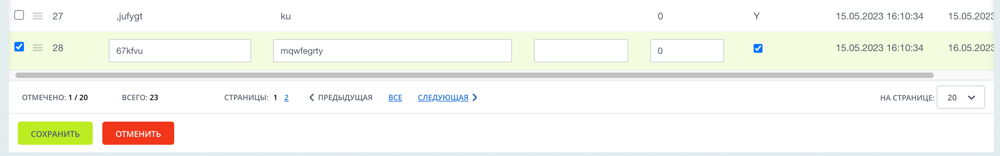

# Сущности
Найти список добавленных сущностей можно по следующему пути:

"Контент" -> "Сущности".

Если для сущности указан title в [аннотации](./annotations.md) метода getTableName() [датаменеджера](./datamanager.md), то название сущности будет человеко-понятным.
Если title не указан, то будет выведено название таблицы.

На странице списка элементов отображается таблица в привычном для всех пользователей Bitrix виде.

Если названия для столбцов не указаны в [датаменеджере](./datamanager.md), то будут выведены названия как в БД.

По каждому столбцу доступна сортировка. Присутствует фильтрация.

Для удобства и понимания с каким столбцом БД происходит работа при наведении на название появляется подсказка с названием в самой БД.

Каждый столбец можно отобразить или скрыть

Доступно редактирование элементов со страницы списка.

Типы данных и возможность редактирования указывается в [датаменеджере](./datamanager.md) сущности, как и обычно.

На детальной странице элемента сущности также заблокированы поля, которые не разрешены к редактированию.
Поля типа ArrayField отображаются в виде json

____
- [<- Настройки модуля](./settings.md)

- [Документация](./instruction.md)
- [Аннотации](./annotations.md)
- [Датаменеджеры](./datamanager.md)
- [README.md](../README.md)