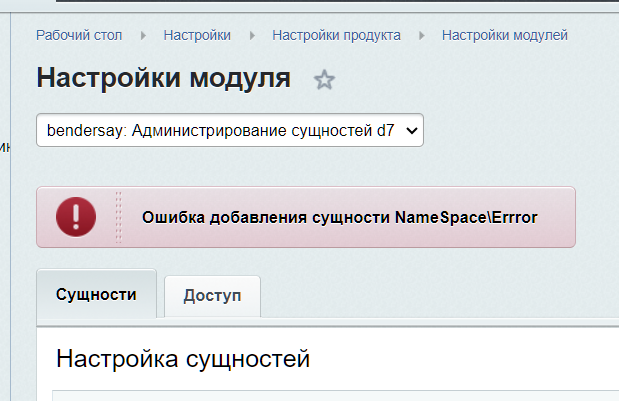

# Настройки модуля
Для того чтобы зайти в настройки модуля в административной части сайта необходимо перейти по следующему пути:

"Настройки" -> "Настройки продукта" -> "Настройки модулей" -> "bendersay: Администрирование сущностей d7".

На странице настроек модуля интересным табом является только "Сущности".

Перед пользователем отображается поле для ввода класса сущности и кнопка добавления нового пустого поля.
В "Классы сущностей" должен указываться полный неймпейс класса сущности, например, Bitrix\Main\UserTable.

Если добавить несуществующий неймспейс или неймспейс не наследуемый от Bitrix\Main\ORM\Data\DataManager, то будет отображена ошибка при сохранении.

____
- [-> Сущности](./entities.md)

- [Документация](./instruction.md)
- [README.md](../README.md)