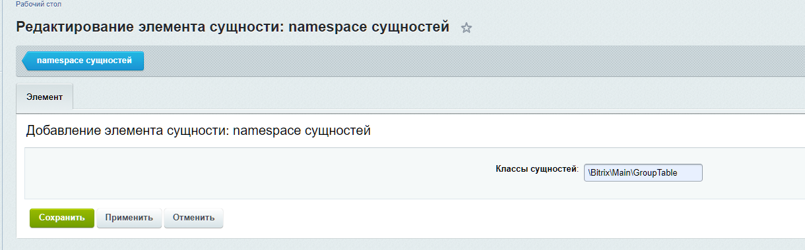

# Настройки модуля
Для того чтобы зайти в настройки модуля в административной части сайта необходимо перейти по следующему пути:

"Настройки" -> "Настройки продукта" -> "Настройки модулей" -> "bendersay: Администрирование сущностей d7".

## Таб "Сущности"

Здесь находятся 2 ссылки:
* Перейти к настройке классов сущностей. [Настройка namespace сущностей](#настройка-namespace-сущностей)
* Перейти к настройке прав доступа для сущностей. [Связь namespace сущностей и группы](#связь-namespace-сущностей-и-группы)

### Настройка namespace сущностей

При клике по "Перейти к настройке классов сущностей" переходим на страницу "Сущность: namespace сущностей".
Здесь можно добавлять/удалять сущности для работы в админке. Указывается полный namespace сущности.

Если добавить несуществующий namespace или namespace не наследуемый от Bitrix\Main\ORM\Data\DataManager, то будет отображена ошибка при сохранении.

### Связь namespace сущностей и группы

При клике по "Перейти к настройке прав доступа для сущностей" переходим на страницу "Сущность: Связь namespace сущностей и группы".
В списке можно увидеть уровень доступа по связке сущность-группа.
Если для одной сущности указаны разные уровни доступа для разных групп и пользователь входит во все эти группы - применяется максимально возможный доступ из указанных.

На странице добавления:
* Сущности выбираются из справочника сущностей, который мы заполняли на странице "списка сущностей".
* Группы выбираются из списка групп пользователей заведенных в системе.
* После указания "id namespace сущностей" и "ID группы пользователей" указывается право доступа для этой связки:
  * D - доступ закрыт. Сущности нельзя просматривать и редактировать. Уровень работает по умолчанию, если не указан доступ для групп в настройках модуля [Таб "Доступ"](#таб-доступ)
  * R - доступ на чтение. Пользователям можно просматривать список элементов сущности, но нельзя редактировать и удалять.
  * W - доступ на добавление/редактирование/удаление. Пользователям можно просматривать, редактировать, удалять элементы сущностей.

## Таб "Доступ"

Здесь настраивается уровень доступа к модулю в разрезе групп пользователей.

Возможны 3 уровня доступа:
* D - доступ закрыт. Сущности нельзя просматривать и редактировать. Уровень работает по умолчанию.
* R - доступ на чтение. Пользователям можно просматривать список элементов сущности, но нельзя редактировать и удалять.
* W - доступ на запись. Пользователям можно и просматривать и редактировать элементы сущностей.

Для группы администраторов доступ всегда W.

Настройки доступа модуля работают для всех сущностей, для которых не указан доступ в [Связь namespace сущностей и группы](#связь-namespace-сущностей-и-группы)

____
- [-> Сущности](./entities.md)

- [Документация](./instruction.md)
- [README.md](../README.md)